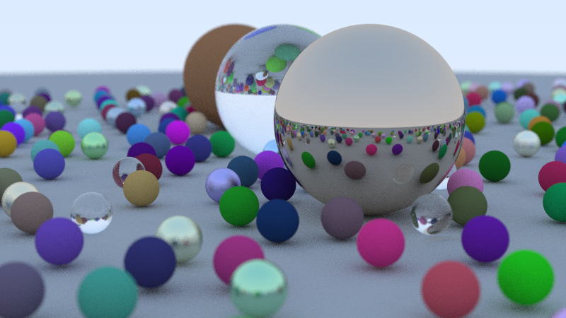

# Monte Carlo Path Tracer (C++17)

A from-scratch, multithreaded CPU path tracer built to learn the core
concepts behind real-time ray tracing and global illumination — written as
prep for AMD's *Software Development Engineer - Ray Tracing / Neural
Rendering* role. It renders the classic "field of spheres" scene with
diffuse, metal, and glass materials, physically based light transport, and
a BVH acceleration structure.



> **Status: work in progress.** The core renderer below is complete and
> tested; I'm still extending it (see [Design notes](#design-notes--what-id-extend-next)
> below) before treating this as finished.

## What it demonstrates

| Concept from the job description | Where it lives in this code |
|---|---|
| Real-time / offline ray tracing fundamentals | `sphere.h` (ray-sphere intersection), `camera.h::ray_color` (recursive ray tracing) |
| Path tracing & Monte Carlo integration | `camera.h::render` — each pixel averages N independently sampled random rays; each bounce is a Monte Carlo sample of the rendering equation |
| Physically based materials | `material.h` — Lambertian (diffuse), Metal (fuzzy specular), Dielectric (glass, Snell's law + Schlick's approximation) |
| Global illumination | Indirect light arrives purely from recursive ray bounces off other objects — no baked lighting |
| Acceleration structures / performance optimization | `bvh.h` — a bounding volume hierarchy; see benchmark below |
| Sampling & antialiasing | `camera.h::get_ray` — jittered per-sample ray origin/direction |
| Depth of field | `camera.h` — defocus disk sampling (thin-lens camera model) |
| Profiling / optimizing graphics workloads | `--benchmark` mode measuring BVH speedup; multithreaded render loop |

## Build & run

```bash
mkdir build && cd build
cmake .. -DCMAKE_BUILD_TYPE=Release
make

# width  samples/pixel  max_depth  output_file
./raytracer 800 100 12 render.ppm

# BVH vs. no-BVH acceleration structure benchmark
./raytracer --benchmark
```

Convert the output `.ppm` to PNG with any image tool, e.g.:

```bash
python3 -c "from PIL import Image; Image.open('render.ppm').save('render.png')"
```

## Measured results (2-core cloud VM)

- **800×450, 100 samples/pixel, depth 12** (487 spheres, BVH-accelerated): **28.1s**, ~1.3 Mray/s effective throughput.
- **BVH acceleration structure benchmark** (300×168, 32 spp, depth 8, same 487-sphere scene): linear scan **8.51s** vs. BVH **1.36s** → **6.24× speedup**. This is the same core idea (spatial acceleration structures a ray traversal engine walks) behind hardware BVH traversal on GPU RT cores — just implemented and measured here on CPU to build intuition for it.

### How the speedup changes across scenes

[`benchmarks/`](benchmarks/) sweeps that BVH-vs-linear-scan comparison across
four axes instead of the one fixed scene above — image size, object count,
camera angle, and material mix — each run multiple times with random scene
variations, with error bars. See [`benchmarks/RESULTS.md`](benchmarks/RESULTS.md)
for the charts and current numbers, or regenerate them yourself:

```bash
cd benchmarks && python3 sweep.py
```

Headline finding: **object count is what actually drives the speedup**
(BVH turns O(N) into ~O(log N), so the gap widens as the scene fills up);
image size, camera angle, and material mix move it only modestly, since
those don't change how many objects a ray has to be tested against.

## Project layout

```
src/
  vec3.h         3D vector math + Monte Carlo sampling helpers (random unit vector, unit disk)
  ray.h          Parametric ray
  interval.h     [min, max] range utility
  aabb.h         Axis-aligned bounding box (BVH primitive)
  hittable.h     Intersectable interface + hit_record
  sphere.h       Ray-sphere intersection
  hittable_list.h  Flat (unaccelerated) object collection
  bvh.h          Bounding volume hierarchy for O(log N) intersection
  material.h     Lambertian / Metal / Dielectric BRDFs
  color.h        Linear-to-gamma color output
  camera.h       Camera model, Monte Carlo render loop, multithreading
  main.cpp       Scene construction + CLI + benchmark mode
```

## How I got here

[`learning/`](learning/) keeps the work behind this project instead of
cleaning it up: the two minimal single-file ray tracers I built before this
one (no materials, no bounces — just ray-sphere intersection, then normal
shading), plus three companion write-ups —

- [Project write-up](learning/portfolio.html)
- [Formula reference](learning/formula_reference.html) — every formula the renderer implements, with a hoverable variable legend and a worked numeric example for each
- [BVH acceleration, diagrammed](learning/bvh_diagram.html) — what an AABB and a BVH actually are, and why walking the tree beats scanning the list

## Design notes / what I'd extend next

This project deliberately covers the fundamentals cleanly rather than
everything at once. The natural next steps toward the full scope of a
real-time ray tracing role are documented in [`LEARNING_ROADMAP.md`](LEARNING_ROADMAP.md):
GPU port (compute shaders / DXR), spatiotemporal reservoir resampling
(ReSTIR) for real-time global illumination without thousands of samples per
pixel, a learned/neural denoiser to make low-sample-count renders viable at
real-time frame rates, and neural scene representations (NeRF, 3D Gaussian
Splatting) as the "neural rendering" half of the role.

## License

Written for personal learning/portfolio use. No external code was copied;
this implements well-established, widely published ray tracing algorithms
(ray-sphere intersection, Lambertian/metal/dielectric BRDFs, BVH traversal,
thin-lens depth of field) from first principles.
