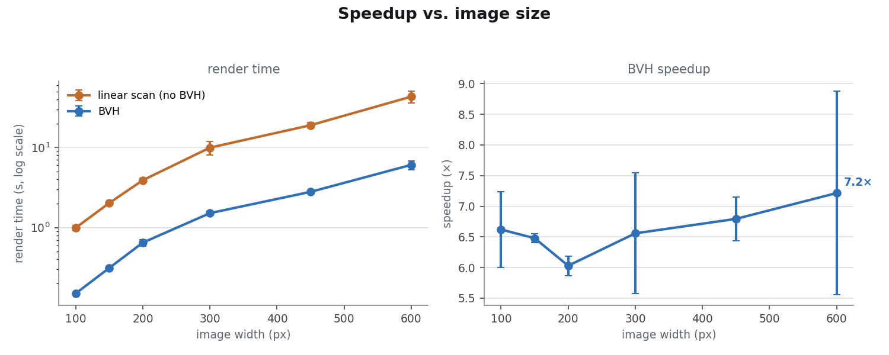
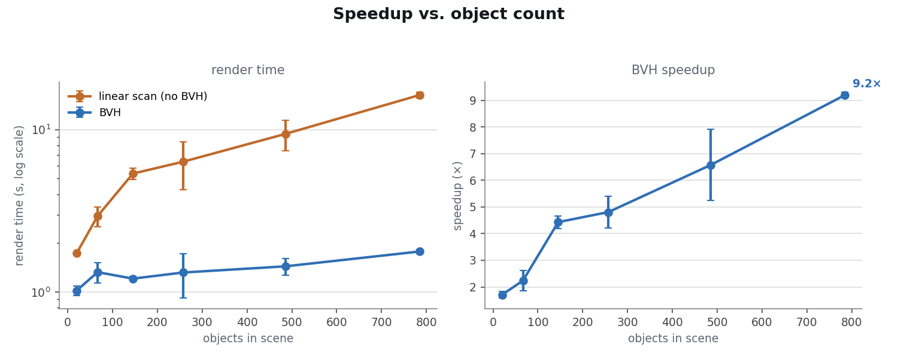
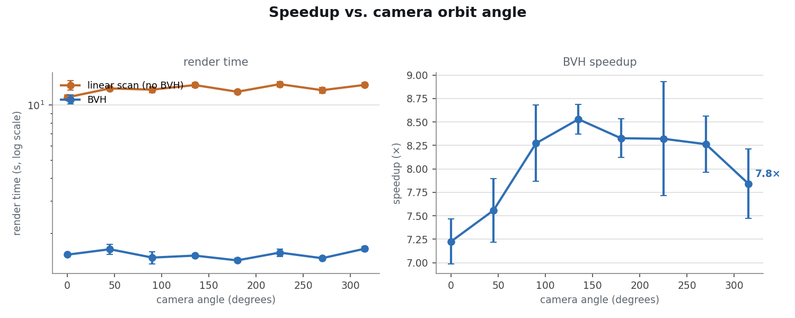
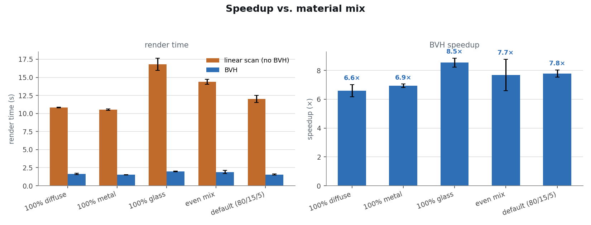

# Benchmark sweep results

Generated by `benchmarks/sweep.py` (3 repeat(s) per configuration; each repeat uses a different random seed, so numbers below are means).

## Speedup vs. image size

| 100 | 150 | 200 | 300 | 450 | 600 |
|---|---|---|---|---|---|
| 6.62× | 6.48× | 6.03× | 6.56× | 6.79× | 7.21× |

## Speedup vs. object count

| r=2 | r=4 | r=6 | r=8 | r=11 | r=14 |
|---|---|---|---|---|---|
| 1.70× | 2.24× | 4.43× | 4.80× | 6.57× | 9.19× |

## Speedup vs. camera orbit angle

| 0° | 45° | 90° | 135° | 180° | 225° | 270° | 315° |
|---|---|---|---|---|---|---|---|
| 7.23× | 7.56× | 8.27× | 8.53× | 8.33× | 8.32× | 8.26× | 7.84× |

## Speedup vs. material mix

| 100% diffuse | 100% metal | 100% glass | even mix | default (80/15/5) |
|---|---|---|---|---|
| 6.60× | 6.93× | 8.54× | 7.68× | 7.78× |
